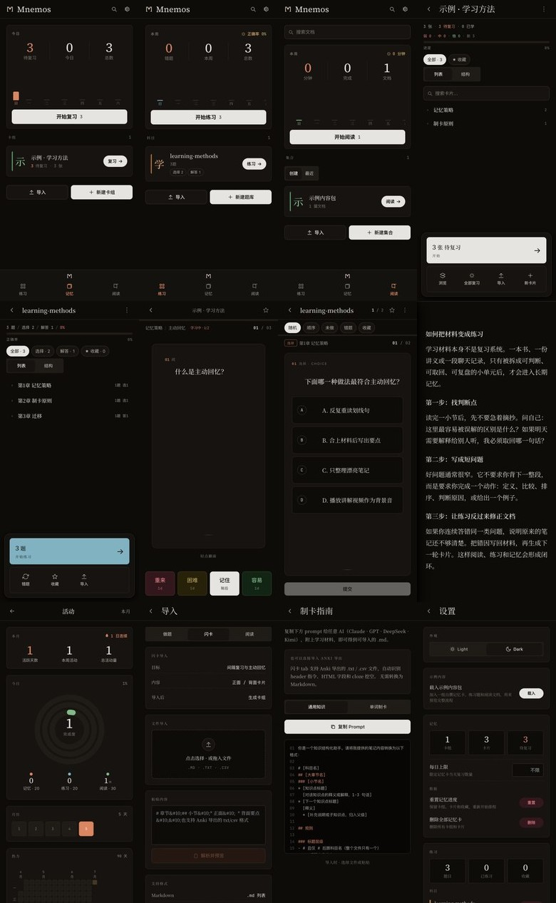
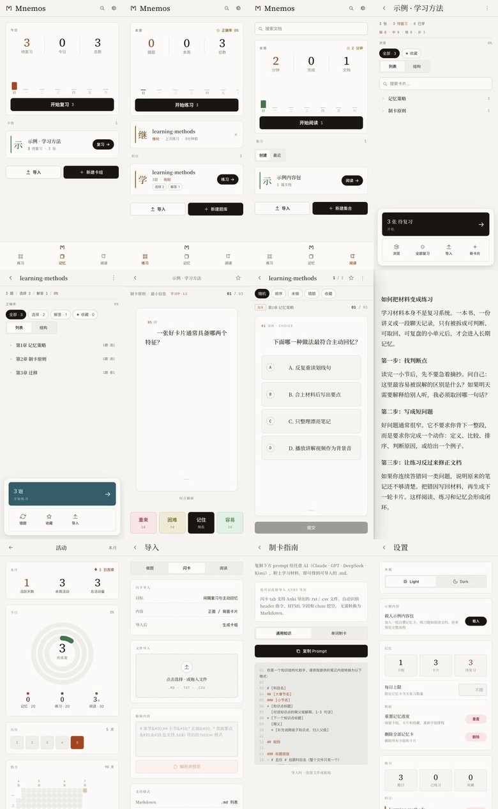

# Mnemos — 间隔重复记忆 · 题库练习 · Markdown 阅读

本地优先的移动端学习工具：SM-2 驱动闪卡复习、选择题/解答题练习、内建 markdown 阅读器。React + Capacitor，无后端、无账号、无应用内 LLM 调用。

[Download APK](https://github.com/lesPrivilege/Mnemos/releases)

<p align="center">
  
</p>

React 18 · Vite 6 · Tailwind 3 · Capacitor 8 · marked + KaTeX + DOMPurify

## 三个模块

| 模块 | 功能 |
|------|------|
| 记忆 | SM-2 调度闪卡复习（学习步骤、leech 检测）、卡组管理、Anki 导入、撤销 |
| 练习 | 选择题/解答题、六种练习模式、错题本、错题→闪卡 |
| 阅读 | .md/.tex/.txt 导入与全屏阅读、LaTeX 渲染、高亮、书签、高亮→闪卡 |

## 架构边界：应用层只消费结构化输出

Mnemos 在架构上做了一个明确选择：**程序内不集成任何 LLM API**。闪卡的 markdown、题库的 JSON、阅读的文档，其生成与结构化全部由外部 CLI 工具与 skill 完成；应用层只负责格式解析、调度算法、渲染与交互。

这个边界带来的结果：

- 应用逻辑稳定在解析器、SM-2 调度、渲染管线上，不随模型迭代或 prompt 调整而折旧
- 内容生成的复杂度（context 组装、prompt 工程、输出校验）被隔离在外部工具链中
- 结构化文档作为持久产出，独立于任何具体 LLM 客户端存在

`src/lib/formatSpec.js` 是闪卡格式的单一事实源（prompt 模板与解析规则同源）；`questionParser.js` 对题库 JSON 做逐层防御校验。解析器的容错策略一致：不符合格式的输入被跳过或隔离，不崩溃、不猜测。完整的设计复盘见 [mnemos-review-2026-05-18.md](mnemos-review-2026-05-18.md)。

## 数据与可靠性

Local-first，两层持久化：大记录（卡片数据、题库）经内存缓存落 IndexedDB，小记录留 localStorage。可靠性设计：

- **损坏不静默**：任何解析失败的存储数据进入隔离区并在 Settings 提供原始导出，而不是被空默认值覆盖
- **备份格式即契约**：完整备份的 JSON 结构冻结为文档（[docs/backup-format.md](docs/backup-format.md)），承诺任何历史备份可导入任何未来版本
- **保守迁移**：localStorage → IndexedDB 走「双写一个版本 → 真机验证 → 切读 → 清理」的路径，迁移读路径永久保留

## 工程方法

这个仓库同时是一份工作流样本。三天完成可用原型（OpenCode + MiMo 执行，Claude 做架构判断与 review），之后进入系统化打磨——路线与执行记录都在仓库里：

- **Spec-as-prompt**：每轮迭代先产出自包含的 implementation prompt（[docs/](docs/) 下的 `feature-*-prompt.md`），再交由 CLI agent 分支实现，双重 review（spec 合规 + 代码质量）后合并。git 历史可验证 spec 先于实现
- **质量弧线**：零测试的 11k 行原型 → vitest + lint + `npm run check` 门禁 → 核心纯函数全覆盖（调度、解析、引擎），每轮迭代测试数只增不减
- **路线图公开**：[docs/roadmap-long-term.md](docs/roadmap-long-term.md)（地基/存储/重构）与 [docs/roadmap-maturity.md](docs/roadmap-maturity.md)（解耦/设计语言/发布路径），完成项标注轮次，取舍理由写在条目里

克制说明：以上不是方法论宣言，只是这个仓库实际的工作方式；判断其成色的方式是读 commit 历史和 docs 目录，而非本节文字。

## 开发

```bash
npm install
npm run dev          # http://localhost:5173
npm run check        # lint + vitest + build（提交门禁）
```

## 打包 APK

```bash
~/Scripts/build-mnemos-apk
# → android/app/build/outputs/apk/debug/app-debug.apk
```

## 项目结构

```
Mnemos/
├── src/
│   ├── lib/                      # flashcard 核心：sm2, scheduler, store/bigStore（存储原语）,
│   │                             #   quarantine（损坏隔离）, formatSpec, renderMarkdown...
│   ├── quiz/                     # quiz 引擎、题目解析、storage
│   ├── reading/                  # 阅读器：renderDoc, highlights, bookmarks, importer
│   ├── pages/ · components/      # 页面与共享组件
│   └── styles/                   # OKLCH token 设计系统
├── docs/                         # roadmap、implementation prompts、backup 格式契约
├── design/                       # hi-fi 原型
├── android/                      # Capacitor Android wrapper
└── assets/screenshots/           # 界面截图
```

## 数据存储

| 位置 | 内容 |
|-----------|------|
| IndexedDB `mnemos/kv` | 卡片数据、题库（大记录，经 bigStore 内存缓存） |
| IndexedDB `mnemos/reading-doc-bodies` | 阅读文档正文 |
| `mnemos-*` / `examprep-*` / `reading-*` (localStorage) | 进度、收藏、日志、设置等小记录 |
| `mnemos-quarantine::*` | 损坏数据隔离区 |

## 导入格式

- **闪卡**：结构化 markdown（`# 科目 ## 章节 - 正面 缩进背面`），或 Anki 导出 .txt/.csv
- **题库**：`questions.json`（choice + review 题型）
- **阅读**：`.md` / `.tex` / `.txt`

## 附录：界面截图

<p align="center">
  
</p>

<p align="center">
  
</p>
